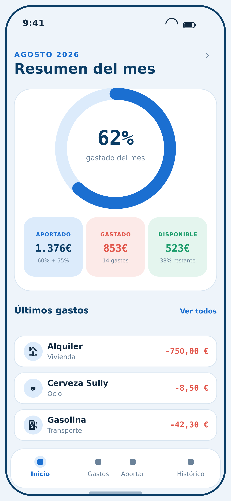
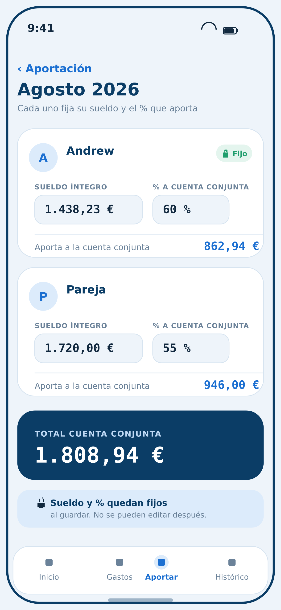
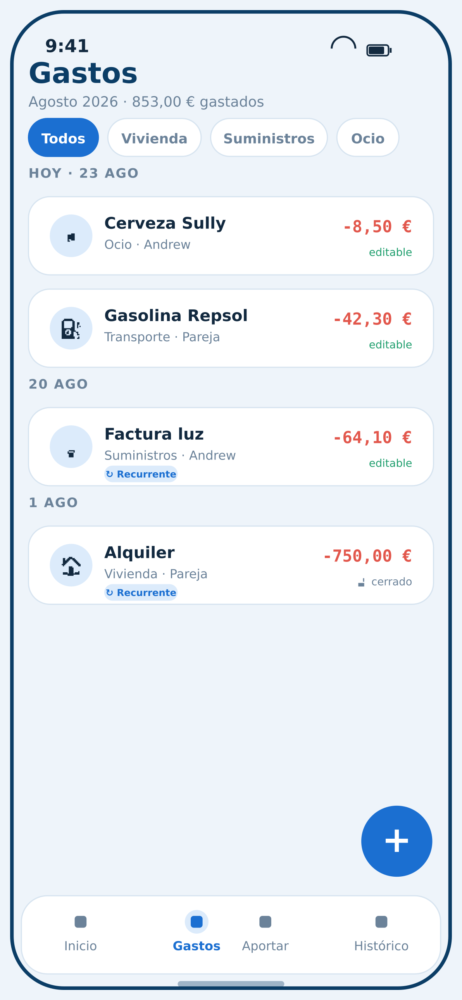
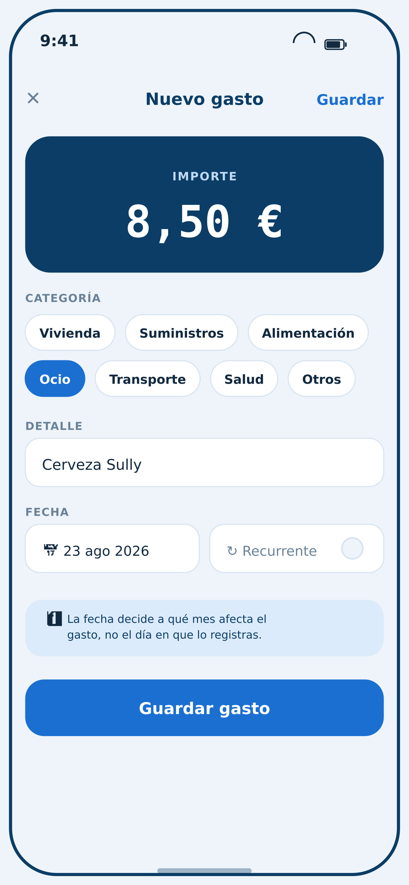
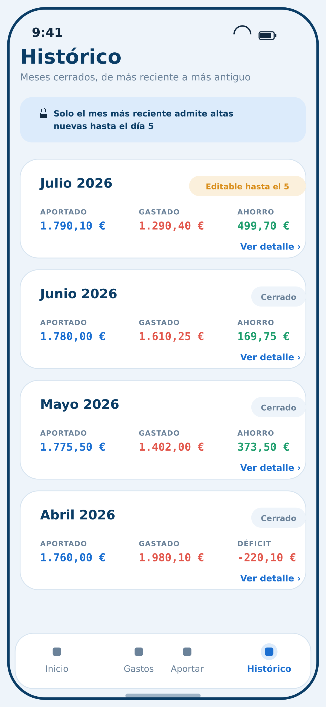

# App de Finanzas Compartidas — Especificación técnica

> Documento de referencia para construir la aplicación. Incluye stack, modelo de datos, reglas de negocio y diseño de pantallas con mockups. Las imágenes están en `./mockups/`.

## 1. Objetivo

Aplicación privada para dos usuarios (pareja) que permite:
- Registrar el sueldo íntegro mensual de cada usuario.
- Fijar un porcentaje **único y compartido** que ambos aportan a una cuenta conjunta.
- Registrar gastos conjuntos (recurrentes y puntuales) y ver, a fin de mes, cuánto se ha gastado y cuánto se ha ahorrado.

La app no gestiona gastos personales ni dinero real: todo lo registrado en ella se considera, por definición, gasto de la cuenta conjunta. Uso estimado: ~5 visitas al día entre los dos usuarios, casi siempre desde móvil (99% del uso).

## 2. Stack tecnológico

| Capa | Tecnología | Motivo |
|---|---|---|
| Frontend + backend | Next.js (App Router) | Un único framework para UI y lógica de servidor (Server Actions), sin API separada |
| Despliegue | Vercel (plan gratuito) | Integración nativa con Next.js, despliegue automático por push a Git |
| Base de datos | Supabase (Postgres) | Free tier permanente, incluye autenticación integrada |
| ORM | Drizzle | Capa fina sobre SQL, sin generación de cliente, migraciones en SQL crudo legible |
| Autenticación | Auth de Supabase | Suficiente para dos usuarios fijos, sin OAuth externo |
| Estilos | Tailwind CSS | Desarrollo rápido sin diseñar un sistema de componentes desde cero |
| Control de versiones | GitHub (repo privado) | Conecta directamente con Vercel para despliegue continuo |

### Pasos de arranque sugeridos
1. `npx create-next-app@latest` (TypeScript + Tailwind + App Router).
2. Repo en GitHub, importado en Vercel (despliegue automático en cada push).
3. Proyecto en Supabase → Postgres + Auth.
4. `npx drizzle-kit` para conectar y definir el schema.
5. Variables de entorno (connection string, claves) en Vercel → Settings → Environment Variables, nunca en el código.
6. Primera pantalla funcional: formulario de sueldo/aportación de extremo a extremo antes de construir el resto.

## 3. Modelo de datos

### 3.1 `usuarios`
| Campo | Tipo | Descripción |
|---|---|---|
| id | uuid | Identificador único |
| nombre | text | Nombre del usuario |

### 3.2 `meses`
Representa cada periodo mensual. Se crea automáticamente el día 1 de cada mes.

| Campo | Tipo | Descripción |
|---|---|---|
| id | uuid | Identificador único |
| anio | int | Año del periodo |
| mes | int | Mes del periodo (1-12) |
| porcentaje | decimal (nullable) | **Porcentaje único de aportación del mes, compartido por los dos usuarios.** Lo puede fijar cualquiera de los dos. Inmutable una vez guardado |
| porcentaje_fijado_por | FK → usuarios (nullable) | Quién fijó el porcentaje |
| porcentaje_fecha_registro | timestamp (nullable) | Cuándo se fijó |
| fecha_apertura | timestamp | Momento en que se creó el mes automáticamente |

> ⚠️ Importante: el porcentaje **no** es un valor por usuario. Es un único dato del mes que se aplica igual a los dos sueldos. No debe existir un campo `porcentaje` en `aportaciones`.

### 3.3 `aportaciones`
Sueldo declarado por cada usuario para un mes. Inmutable una vez guardado.

| Campo | Tipo | Descripción |
|---|---|---|
| id | uuid | Identificador único |
| mes_id | FK → meses | Mes al que pertenece |
| usuario_id | FK → usuarios | Usuario al que corresponde el sueldo |
| sueldo | decimal | Sueldo íntegro declarado, inmutable tras guardar |
| importe_aportado | decimal (nullable) | `sueldo × meses.porcentaje`, calculado y guardado en cuanto ambos valores existen (ver regla 4.1) |
| fecha_registro | timestamp | Cuándo se guardó el sueldo |

El total de la cuenta conjunta del mes = suma de `importe_aportado` de ambos usuarios.

### 3.4 `gastos`
| Campo | Tipo | Descripción |
|---|---|---|
| id | uuid | Identificador único |
| mes_id | FK → meses | Mes al que afecta el gasto (según su fecha, no según cuándo se registró) |
| categoria | enum/text | Vivienda · Suministros · Alimentación · Ocio · Transporte · Salud · Otros |
| detalle | text | Campo libre específico (ej. "cerveza Sully") |
| importe | decimal | Importe del gasto |
| fecha_gasto | date | Fecha del gasto; por defecto la actual, editable al crear |
| es_recurrente | boolean | Indica si es un gasto recurrente (alquiler, agua, luz...) |
| gasto_recurrente_origen_id | FK → gastos (nullable) | Si viene de duplicación automática, referencia al gasto del mes anterior del que procede |
| creado_por | FK → usuarios | Usuario que registró el gasto |
| fecha_creacion | timestamp | Cuándo se registró en la app |

### 3.5 `historico_movimientos`
Auditoría completa. Toda acción relevante genera una entrada aquí.

| Campo | Tipo | Descripción |
|---|---|---|
| id | uuid | Identificador único |
| usuario_id | FK → usuarios | Quién hizo la acción |
| entidad | text | Tabla afectada: `meses`, `aportaciones`, `gastos` |
| entidad_id | uuid | Registro afectado |
| accion | enum | `crear` · `editar` · `eliminar` |
| valor_anterior | jsonb (nullable) | Estado antes del cambio (null si es creación) |
| valor_nuevo | jsonb (nullable) | Estado después del cambio (null si es eliminación) |
| fecha | timestamp | Momento exacto del cambio |

## 4. Reglas de negocio

### 4.1 Sueldos y aportación
- Cada usuario introduce su sueldo íntegro una vez al mes. Inmutable tras guardar.
- El porcentaje de aportación es **único para el mes y compartido por los dos usuarios** — no hay un % distinto por persona. Puede fijarlo cualquiera de los dos. Inmutable tras guardar.
- `importe_aportado` se calcula y persiste en cuanto están disponibles tanto el sueldo del usuario como el porcentaje del mes — sea cual sea el orden en que se guarden ambos datos (si el sueldo se guarda antes que el porcentaje, el cálculo se dispara al fijar el porcentaje, y viceversa).
- Total de la cuenta conjunta del mes = suma de `importe_aportado` de los dos usuarios. No hay cálculos adicionales.

### 4.2 Cambio de mes
- El día 1 de cada mes se crea automáticamente un nuevo registro en `meses`.
- Los gastos recurrentes del mes que se cierra se duplican automáticamente al mes nuevo, con el importe con el que quedaron (encadenado mes a mes).

### 4.3 Edición de gastos y ventana de gracia
- **Mes actual:** gastos totalmente editables y eliminables.
- **Mes anterior, hasta el día 5 (inclusive) del mes en curso:** editable, eliminable, y se pueden añadir gastos nuevos con fecha de ese mes.
- **A partir del día 6:** el mes anterior queda congelado — solo se pueden añadir gastos nuevos (para olvidos), no editar ni eliminar los existentes.
- **Dos meses atrás o más:** completamente congelado, solo consulta.
- El criterio siempre es el mes de la **fecha del gasto**, no el mes en que se registra en la app.

### 4.4 Auditoría
- Toda acción — fijar un sueldo, fijar el porcentaje del mes, crear/editar/eliminar un gasto, apertura automática de mes — genera una entrada en `historico_movimientos` con quién, cuándo, valor anterior y valor nuevo.

### 4.5 Categorías de gasto
- Vivienda, Suministros, Alimentación, Ocio, Transporte, Salud, Otros.
- Cada gasto lleva además un campo de texto libre para el detalle específico dentro de la categoría.

## 5. Sistema de diseño

Estilo azul. Mobile-first: una sola columna, navegación inferior fija, tarjetas grandes y táctiles. El protagonista visual constante es el estado del mes: aportado / gastado / disponible.

### 5.1 Color
| Token | Hex | Uso |
|---|---|---|
| Azul marino | `#0B3D66` | Cabeceras, tarjeta de total, textos de mayor peso |
| Azul primario | `#1B6FD1` | Acentos, botones, cifra "aportado" |
| Azul cielo | `#6FB1F0` | Elementos secundarios |
| Azul cielo pálido | `#DCEBFB` | Fondos suaves, chips inactivos con tinte |
| Fondo app | `#EEF4FA` | Fondo general |
| Superficie | `#FFFFFF` | Tarjetas |
| Tinta (texto) | `#12293F` | Texto principal |
| Gris (texto secundario) | `#6B8299` | Texto secundario/etiquetas |
| Borde | `#D7E4F0` | Bordes de tarjetas y campos |
| Verde (disponible/ahorro) | `#1F9E6D` | Exclusivo para dinero a favor |
| Verde fondo | `#E4F5EE` | Fondo de tarjeta "disponible" |
| Coral (gastado/déficit) | `#E2574C` | Exclusivo para dinero gastado o negativo |
| Coral fondo | `#FCEAE8` | Fondo de tarjeta "gastado" |
| Ámbar | `#D98E1B` | Estado "editable hasta el día 5" |

Regla de color: verde y coral están **reservados exclusivamente** para significado económico (a favor / en contra). No se usan como colores decorativos en ningún otro lugar de la interfaz.

### 5.2 Tipografía
- **Interfaz general** (títulos, etiquetas, texto): familia de palo seco (ej. Inter, Manrope o system-ui), pesos regular y bold.
- **Cifras de dinero** (sueldos, aportaciones, importes de gastos, totales): familia **monoespaciada** (ej. JetBrains Mono, IBM Plex Mono) en todas las cantidades, sin excepción. Los dígitos alineados dan lectura rápida y refuerzan que son datos serios/auditables.

### 5.3 Patrones visuales recurrentes
- 🔒 = dato inmutable (sueldo/porcentaje ya guardado, mes cerrado).
- ↻ = gasto recurrente.
- Verde = dinero a favor. Coral = dinero gastado o en contra. Mismo código en toda la app.
- Navegación inferior fija, 4 destinos: Inicio · Gastos · Aportar · Histórico.
- Tarjetas con esquinas muy redondeadas (`radius` grande, ~18–28px), sombra suave, mucho aire entre bloques.

## 6. Pantallas

### 6.1 Inicio (resumen del mes)

Pantalla de apertura de la app, la más visitada.
- Selector de mes en cabecera (por defecto el mes en curso).
- Anillo de progreso central: % del total aportado ya gastado. Elemento con más peso visual de toda la app.
- Tres tarjetas de estado, siempre en este orden: **Aportado** (azul) / **Gastado** (coral) / **Disponible** (verde), cifras en monoespaciada.
- Debajo: nota del total aportado del mes y número de gastos.
- Lista "Últimos gastos" (los 3 más recientes) con acceso a "Ver todos".

### 6.2 Aportación del mes

- Una tarjeta por usuario con su inicial/avatar.
- Campo de sueldo, editable solo hasta guardar; al guardar, insignia "🔒 Fijo" y el campo pasa a solo lectura.
- El porcentaje es un **único selector compartido para el mes** (no uno por tarjeta de usuario — corregir respecto al mockup, que mostraba un % independiente por persona). Al fijarlo, queda igual de inmutable y visible en ambas tarjetas.
- Cada tarjeta muestra el `importe_aportado` resultante de ese usuario (sueldo × porcentaje del mes).
- Tarjeta inferior de "Total cuenta conjunta" en azul marino, suma de ambos `importe_aportado`.
- Aviso fijo al pie: sueldo y porcentaje son inamovibles una vez guardados.

### 6.3 Gastos

- Chips de categoría para filtrar (con scroll horizontal si no caben todas).
- Gastos agrupados por fecha, más recientes primero: icono de categoría, detalle, categoría + quién lo registró, importe en coral, etiqueta "↻ Recurrente" cuando aplica.
- Estado de edición visible por gasto: "editable" (verde) o "🔒 cerrado" (gris), según la regla 4.3.
- Botón flotante "+" abajo a la derecha, alcanzable con el pulgar (uso a una mano).

### 6.4 Nuevo / editar gasto

- Bloque superior azul marino con el importe en tipografía grande monoespaciada — lo primero que se rellena, lo más visible.
- Selector de categoría por chips (selección única) + campo de texto libre "Detalle".
- Campo de fecha, por defecto la actual, editable para registrar gastos pasados.
- Interruptor "Recurrente".
- Nota fija explicando que la fecha decide a qué mes afecta el gasto, no el día en que se registra.
- Mismo formulario, precargado, para editar un gasto existente cuando el mes lo permite.

### 6.5 Histórico

- Aviso fijo arriba recordando la ventana de gracia (solo el mes más reciente admite altas hasta el día 5).
- Una tarjeta por mes cerrado, con Aportado / Gastado / Ahorro (o "Déficit" en coral si el gasto superó lo aportado).
- Etiqueta de estado: "Editable hasta el 5" (ámbar) o "Cerrado" (gris).
- "Ver detalle" lleva al listado de gastos de ese mes, en modo lectura (o con alta permitida si sigue en ventana de gracia).

## 7. Navegación

| Sección | Contenido |
|---|---|
| Inicio | Resumen del mes en curso: aportado, gastado, disponible, últimos gastos |
| Gastos | Listado completo del mes, filtro por categoría, alta rápida |
| Aportar | Sueldo de cada usuario + porcentaje único del mes |
| Histórico | Meses cerrados, balance y acceso al detalle de cada uno |

## 8. Cómo usar este documento con el agente

1. Copia esta carpeta (`spec.md` + `mockups/`) dentro del repo del proyecto, por ejemplo en `docs/`.
2. Pide al agente que lea `spec.md` completo antes de generar nada, y que abra las imágenes de `mockups/` para replicar layout, espaciado y color con la mayor fidelidad posible — no solo guiarse por la descripción en texto.
3. Sugerencia de orden de construcción: (1) esqueleto Next.js + Tailwind con los tokens de la sección 5, (2) schema de Drizzle a partir de la sección 3, (3) pantalla Inicio primero (sección 6.1), por ser la más visitada y la que fija el lenguaje visual del resto, (4) el resto de pantallas en el orden del punto 6.
4. Si el agente se desvía del estilo (colores, tipografía, radios de borde), señálale directamente la sección 5 y el mockup correspondiente en vez de describir la corrección de palabra — es más preciso partir de la imagen.
